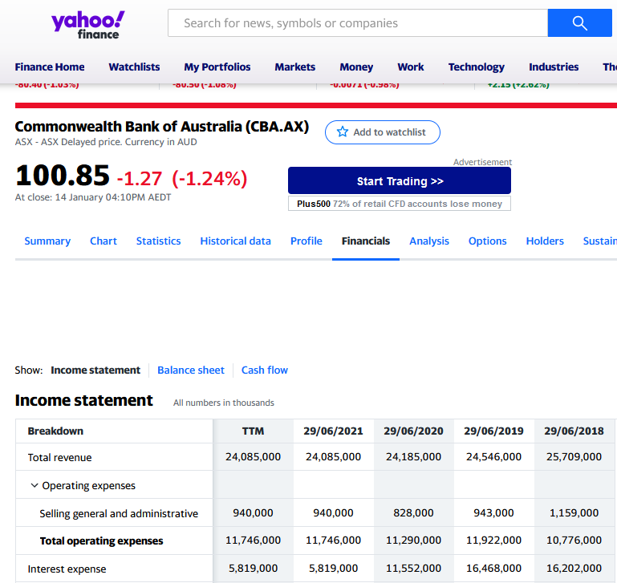
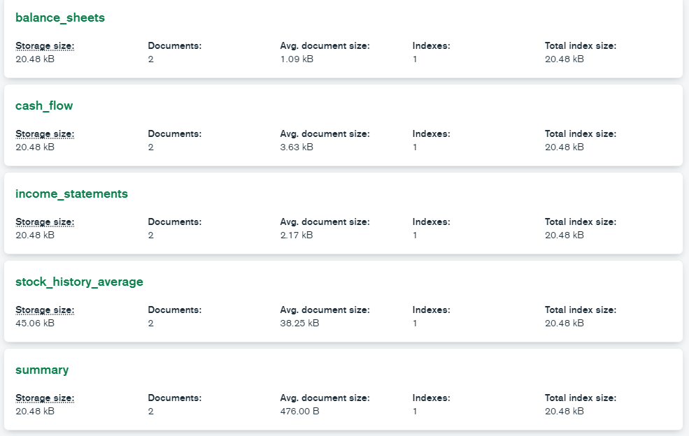
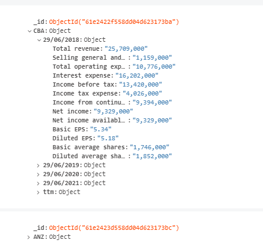
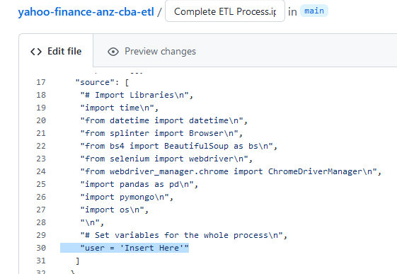

# Yahoo Finance ANZ/CBA ETL

## Overview of the Project

This is an ETL (extract, transform, load) process which scrapes several pages of the most recent data from the Yahoo Finance website regarding the the CBA (Commonwealth Bank of Australia) and ANZ (Australia and New Zealand Banking Group Limited) stocks.



<br>

This ETL process creates a database in MongoDB containing two collections for both stocks, and two stock historical data csv files for both stocks and saves them in the location of the cloned repository.

**Database Structure**



<br>

**Example collection (Income Statements)**



<br>

## Tools/Packages used
- Python
  - datetime
  - splinter
  - BeautifulSoup
  - selenium import webdriver
  - pandas
  - pymongo
- MongoDB

<br>

## How to use
- Clone the respostiory to your Desktop.
- Pip install all the modules listed in ***Tools/Packages used***.
- open jupyter notebook in git bash and open the ***Complete ETL Process.Ipynb*** notebook.
- change the ```user``` variable on line 30.



<br>

## Resouces used for this project
- Data Resources: Yahoo Finance
  - ANZ: https://au.finance.yahoo.com/quote/ANZ.AX
  - CBA: https://au.finance.yahoo.com/quote/CBA.AX
